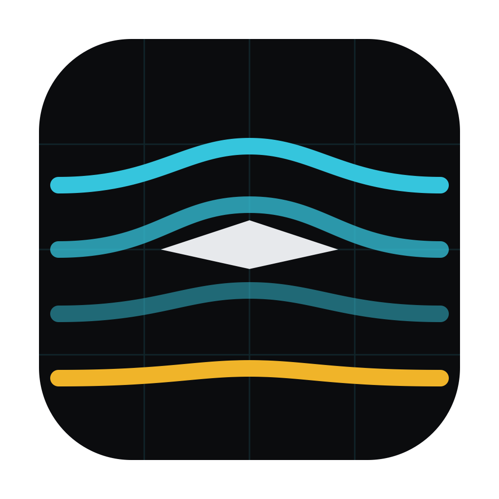

<p align="center"></p>

# WindTunnel

**Drop in an STL. Get a wind tunnel analysis. Free, local, yours.**

WindTunnel is a desktop virtual wind tunnel for anyone with a shape and a question:
RC planes and multirotors, model cars, bike and motorcycle fairings, spoilers and
cowlings, pinewood derby racers, boat hulls, architectural models — anything you can
export as an STL. It wraps [OpenFOAM](https://www.openfoam.com)
(the industry-standard open-source CFD solver) in a one-window app: no dictionaries,
no meshing tutorials, no cloud fees.

- **Drag & drop an STL** → live 3D preview showing exactly how it will sit in the tunnel
- **Real CFD**: automatic meshing (snappyHexMesh) + steady RANS (simpleFoam, k-ω SST)
- **Results that matter**: drag & lift coefficients and forces, frontal area,
  pressure-vs-viscous drag breakdown, convergence quality
- **See the flow**: surface pressure maps, movable flow slices on all three axes
  (with sweep animation), velocity-colored streamlines
- **Go further**: yaw/pitch sweeps with angle charts, two-run comparison, and — for
  aircraft — propeller actuator disks for powered flow plus an auto-**trim solver**
  that finds the forward-flight attitude and per-motor thrust for weight and speed
- Runs **auto-stop when converged**, saving 30–40% of solve time
- **One-click model repair**: broken CAD exports (holes, overlapping parts, loose
  sheets) are rebuilt as one closed solid and checked against the original
- **Half-model symmetry solves** for mirror-symmetric shapes, and a rolling-road
  ground plane for vehicles

## Why

Commercial CFD tools are either too expensive or take far too long to learn.
Open-source solvers like OpenFOAM are just as accurate, but they give you text
dictionaries and a terminal, not the smooth workflow of enterprise software. As a
college student I have neither the budget for licenses nor the time to hand-build
meshes for every design change. WindTunnel keeps OpenFOAM's solver and handles all
the setup around it, so a full 3D velocity and pressure analysis starts with
dropping in an STL.

## Getting started (3 steps)

1. **Install OpenFOAM** (one-time):
   ```sh
   brew install --cask gerlero/openfoam/openfoam
   ```
2. **Install WindTunnel**: [build from source](#building-from-source) (a few
   minutes). Prebuilt `WindTunnel.zip` downloads will be posted under
   [Releases](../../releases). After unzipping one into `/Applications`, read the
   first-launch note below.
3. **Run your first analysis**: open WindTunnel, drop an STL onto the target,
   check the unit (mm for 3D-print exports), set a wind speed, pick **coarse**
   quality, and hit **Run analysis**. A few minutes later you'll have a drag
   coefficient and a flow field to explore. Tip: coarse is great for comparing
   design variants; medium/fine for final numbers.

## "macOS says the app is from an unidentified developer"

WindTunnel is free and unsigned — an Apple Developer certificate costs $99/year,
which this project doesn't have (yet). The app is open source, and you can read or
build every line of it. To open it the first time:
**System Settings → Privacy & Security → "Open Anyway"**.

## How it works

Your STL is scaled, centered, and rotated to the requested attitude, then placed in
an automatically-sized virtual tunnel (blockage-checked). snappyHexMesh builds a
body-fitted hex mesh with boundary layers; simpleFoam solves steady incompressible
RANS on all cores; force coefficients, residuals, slices, and streamlines are
extracted and streamed to the UI live. Everything runs on **your** machine —
no uploads, no accounts, no queue behind strangers.

Propellers are modeled as actuator disks (momentum sources) — enough physics to
show real downwash, inflow, and airframe download without blade-resolved meshing.

## Building from source

```sh
# backend (Python 3.12+)
cd backend && python3 -m venv .venv
.venv/bin/pip install fastapi 'uvicorn[standard]' python-multipart numpy scipy trimesh meshio \
  scikit-image fast-simplification
# optional (~170 MB): smaller repaired models via topology-preserving decimation
.venv/bin/pip install pymeshlab
# frontend (Node 20+)
cd ../frontend && npm install && npm run build
# desktop app
cd ../backend && .venv/bin/pip install pywebview pyinstaller
.venv/bin/pyinstaller --noconfirm --windowed --name WindTunnel \
  --icon ../assets/WindTunnel.icns \
  --add-data "../frontend/dist:ui" \
  --add-data "app/foam_template:app/foam_template" \
  --collect-submodules app \
  --hidden-import uvicorn.logging --hidden-import uvicorn.loops.auto \
  --hidden-import uvicorn.protocols.http.auto \
  --hidden-import uvicorn.protocols.websockets.auto \
  --hidden-import uvicorn.lifespan.on \
  desktop_app.py
open dist/WindTunnel.app
```

For development, run the backend (`uvicorn app.main:app --port 8000`) and frontend
(`npm run dev`) separately; see [docs/CONTRACT.md](docs/CONTRACT.md) for the full
architecture and API.

## Fair warnings

- CFD accuracy depends on mesh resolution: **coarse** answers "is A better than B",
  **fine** answers "what's the number". Trust trends more than the third decimal.
- Runs are CPU-hungry by design — a coarse run uses ~6 cores for a few minutes.
- Run data lives in `~/.windtunnel` (OpenFOAM can't handle spaces in paths, so not
  `~/Library/Application Support`).

## License

MIT for everything in this repository. OpenFOAM is a separate GPL-licensed program
invoked as an external process — it is not bundled; install it from
[openfoam.app](https://github.com/gerlero/openfoam-app) or openfoam.com.

This offering is not approved or endorsed by OpenCFD Limited, producer and
distributor of the OpenFOAM software via www.openfoam.com, and owner of the
OPENFOAM® and OpenCFD® trade marks.
